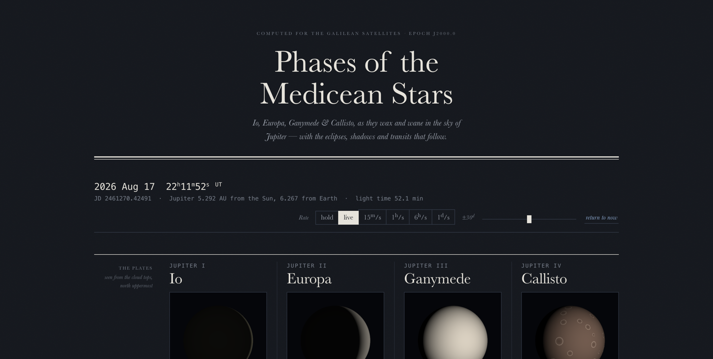
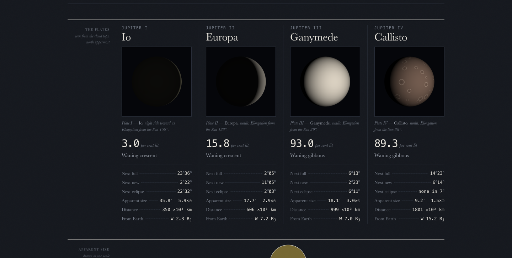

# Phases of the Medicean Stars

**Live demo → https://jupiter-moon-phases.vercel.app**

A live ephemeris of the four Galilean moons as they appear **from Jupiter** — their
phases, eclipses, shadow transits, and the view back from Earth.



Open `index.html` in any browser. No build step needed to run it, no network access,
no dependencies.

```bash
open index.html
```

## What it shows



*One instant, 2026 Aug 17: Io a 3% crescent, its night side faintly washed by
Jupiter-shine. The page recomputes continuously, so the live demo will show a
different configuration.*

- **The plates** — Io, Europa, Ganymede and Callisto rendered as lit spheres, with a
  true Lambertian terminator, Minnaert limb darkening, and Jupiter-shine on the night
  side (~1.5% of sunlight at Io, the earthshine analogue). A moon inside Jupiter's
  shadow goes deep red.
- **Apparent size** — all four against the Sun's disk at 5 AU, to one scale.
- **Geometry** — the system from above Jupiter's north pole (why the phase is what it
  is), and the same instant through a terrestrial telescope.
- **Ephemeris** — eclipses, shadow ingress/egress and phase moments for the next seven
  days, in *Astronomical Almanac* notation (`Ec.D`, `Ec.R`, `Sh.I`, `Sh.E`).

Time can be held, run at up to 1 day/second, or scrubbed ±30 days.

## Layout

| file | |
|---|---|
| `src/app.html` | the app — markup, styles and script, skeleton-free |
| `index.html` | generated standalone page (`node build.mjs`) |
| `build.mjs` | wraps `src/app.html` in an HTML skeleton |
| `verify.mjs` | physical verification suite (`node verify.mjs`) |

`src/app.html` carries no `<!doctype>`/`<html>`/`<head>` of its own so the same file can
be published as a hosted page. After editing it, run `node build.mjs` to regenerate
`index.html`.

## The physics

Satellite positions come from Meeus, *Astronomical Algorithms* (2nd ed.) ch. 44, the
low-precision theory — good to about 0.1 Jupiter radii. The block between the
`@ephemeris` markers in `src/app.html` is self-contained; `verify.mjs` extracts and
exercises it directly, so the tests run against shipping code rather than a copy.

Phase follows from `uS`, the moon's angle from superior conjunction referred to the Sun:
a moon is **full** at `uS = 0`, on Jupiter's night side, and **new** at `uS = 180°`,
between Jupiter and the Sun. Illuminated fraction is `k = (1 + cos uS)/2`.

Two consequences the app makes visible:

- Eclipses happen at full and shadow transits at new — necessarily, since both require
  the moon on the Sun–Jupiter axis. Verified over 200 days: every eclipse begins at
  k > 0.98, every shadow transit at k < 0.02.
- Jupiter's axis leans only 3.1°, so Io, Europa and Ganymede fall into the shadow at
  *every* full phase. Callisto, at 26 Jupiter radii, can ride clear — it passes whole
  years untouched, then keeps a season of eclipses near Jupiter's equinox, once in about
  six years.

## Verification

```bash
node verify.mjs
```

75 checks, covering Meeus' own worked example (1992 Dec 16.0 TD, reproduced to within
0.04 Jupiter radii), the triangle inequality and orbital distance ranges over 40 years, an
independent two-body Kepler cross-check of Jupiter's heliocentric distance, synodic
periods derived from eclipse recurrence, the phase/eclipse coupling, Callisto's
six-year eclipse seasons, angular sizes, umbral cone geometry, light time, and the
Jupiter-shine irradiance law.

## A note on the design

Single-theme by intent. The plates are photometric — inverting them for a light theme
would be physically wrong — so the sheet is pitched dark to sit around them.

## How this was built

The code was written by Claude Code (Opus 5) under my direction: I set the concept and
the visual direction, and required every physical claim to be verified rather than
asserted. That requirement is what produced `verify.mjs`, which caught several defects
that reading the code alone would have missed.

## License

MIT — see [LICENSE](LICENSE).
